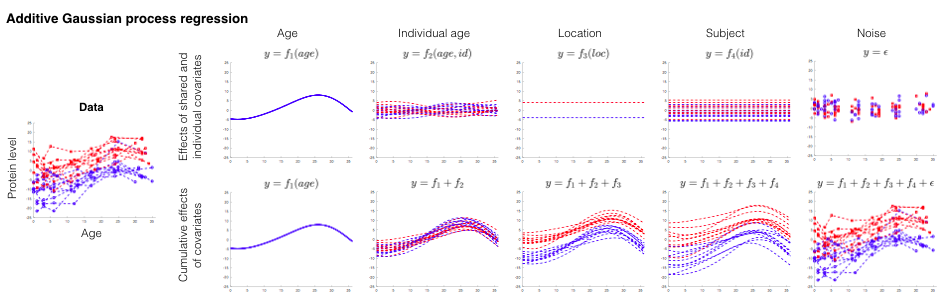
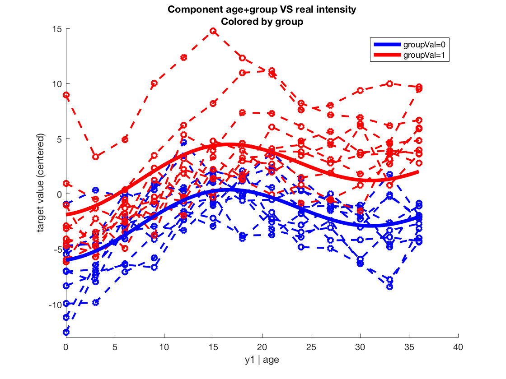

# LonGP: An additive Gaussian process regression model for interpretable non-parametric analysis of longitudinal data

LonGP is a tool for performing Gaussian process regression analysis on logitudinal -omics data with complex study designs. It enables the user to 

* model different nonlinear effects with little effort 
* automatically select the best subset of covariates
* decompose complex data non-linear effects, as shown in the following example



## Installation (Octave version)
### Requirement
* Linux/Mac system
* [Octave 4.4.0](https://www.gnu.org/software/octave/) or later
* [GPstuff-octave-4.7](https://github.com/gpstuff-dev/gpstuff/tree/octave_release)  or later, or our [tested version](./gpstuff_octave.zip)

### Steps
1. Install [GPstuff 4.7](https://github.com/gpstuff-dev/gpstuff), this takes ~10 minutes. It is recommended to use the tested version, which is included in this LonGP package (gpstuff_octave.zip	).

```
# example installation of Octave 4.4.1 in Ubuntu 18.04, follow instructions in 
# http://ubuntuhandbook.org/index.php/2018/07/install-latest-gnu-octave-4-4-ubuntu-18-04/
sudo apt-get install flatpak # install flatpak
flatpak remote-add --if-not-exists flathub https://flathub.org/repo/flathub.flatpakrepo
flatpak install flathub org.octave.Octave
# make alias for octave
echo "alias octave=\"flatpak run org.octave.Octave\"" >> ~/.bashrc
source ~/.bashrc
octave # start octave

# now start Octave and install dependent package "statistics"
pkg install -forge io
pkg install -forge statistics

# install gpstuff
cd('PATH_TO_GPstuff_INSTALLATION')  % change to GPstuff directory
gpstuff_install()
```

2. Move [LonGP_Octave](https://github.com/chengl7/LonGP/archive/LonGP_Octave.zip) to the root folder of GPstuff
3. Unzip "LonGP_Octave.zip" and rename the folder to "LonGP"
4. Replace the "startup.m" file in GPstuff root folder by "startup.m" under the LonGP folder
5. test LonGP

```
# in Octave command window
cd('PATH_TO_GPstuff_INSTALLATION') 
startup
cd('LonGP')
lonGP('./test/output',1)  % run LonGP.m for test data
```

## Example Usage (Serial)
* Prepare the input data. The example data are located in the folder "./example/data" as tab delimited text file "X.txt" and "Y.txt".
* Generate the input parameter configuration file either using the GUI or manually edit using a text editor. The example input parameter file is located in "./example/input.para.txt". To start the GUI, click "APPS" in the top panel and then click "LonGP_UI".
* Run LonGP analysis. Start Matlab, type the following code. To shorten the running time for test purposes, modify file "private/runMCMC.m" to sample less MCMC samples in either of the following ways.  It takes around 8 hours to run for all targets. 
	*  Comment (use % sign) line 12 and uncomment line 13
	*  Delete "runMCMC.m" and rename "runMCMC1.m" to "runMCMC.m".

```
cd('PATH_TO_LONGP_INSTALLATION')  % change to LonGP directory
run('../startup.m')    % load GPstuff environment
lonGP('./example',1)   % run for target variable 1
lonGP('./example',2)   % run for target variable 2
```
* Collect the results in a spreadsheet file. Type the following command in matlab or using GUI. "finalResult.xlsx" and "varExplained.txt" will be generated under the output folder "./example". "varExplained.txt" contains the explained variances of the terms in the final model of each target. The user needs to manually copy it to the spreadsheet.


```
collectResult('./example') 
```
* Generate plots of components. The following code will plot the cumulative effects of the given components, against the real data.


```
targetResultDirectory='./example/Results/1';
xInd = 1; % index of covariate used as x-axis in the plot, here 1st covariate is age
colorInd = 5; % index of covariate used to color individuals, here 5th covariate is group
componentInds=[1 3]; % indexes of the components in the cumulative effect, final model can be seen in "summary.txt".
                     % Final model: model 2 ~ age+diseAge+group+id+age*id. 
                     % Terms 1 and 3 correspond to age+group
genComPlots(targetResultDirectory, xInd, colorInd, componentInds)
```


* Expected output can be found in [exmaple/expectedOutput.zip](./example/expectedOutput.zip)

## Example Usage (Parallel)
We assume a cluster system with shared file system to deploy the work, i.e. all nodes access the same file system. LonGP uses the shared file system to synchronize different task. The running time is ~2 hours with two workers and two slaves, each with 4GB memory.

```
% This part is the same for all nodes
cd('PATH_TO_LONGP_INSTALLATION')  % change to LonGP directory
run('../startup.m')    % load GPstuff environment

% start the task manager, need to run before the workers and slaves
paraLonGP('./example',0)   % run on node 1

% start a worker for target variable 1
paraLonGP('./example',1)   % run on node 2, worker become slave once finished

% start a worker for target variable 2
paraLonGP('./example',2)   % run on node 3, worker become slave once finished

% start a slave 
paraLonGP('./example',slaveId)   % slaveId=10 is a number larger than the total number of targets (2)
```

## Practical details
* Both input files "X.txt" and "Y.txt" must have headers.
* Both input files must be tab delimitered and end with ".txt" file suffix. 
* In "X.txt", the continuous covariates (specific to each time point such as age) should be placed in front of the discrete covariates (specific to each individual such as gender). 
* In "X.txt", the last covariate must be "id" covariate, which is a interger representing an individual.
* Missing values in "X.txt", e.g. diseAge for control, should be marked as "NaN".


